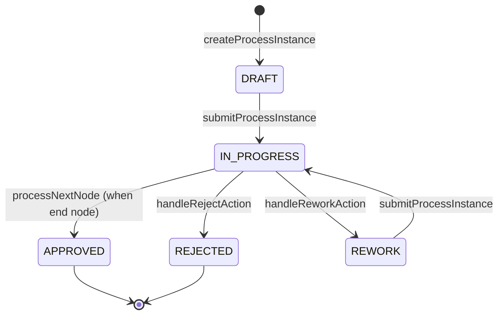
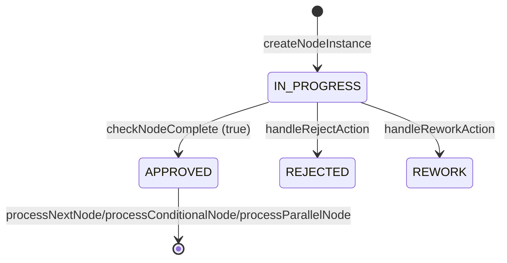
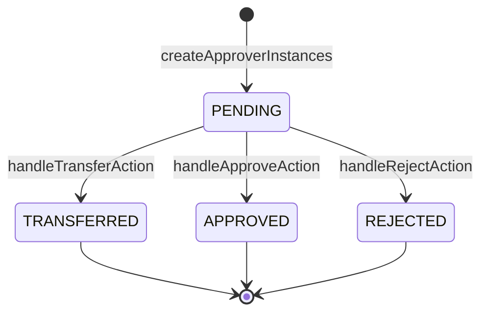
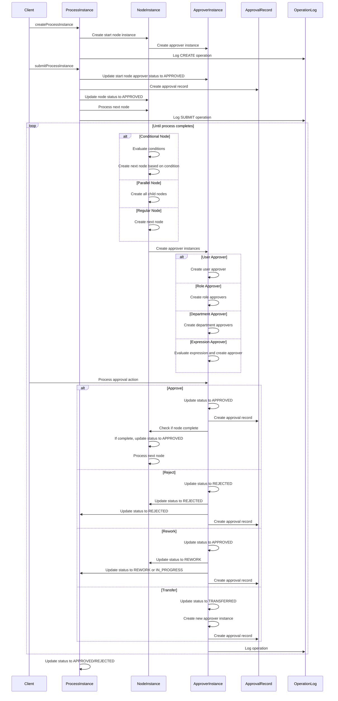
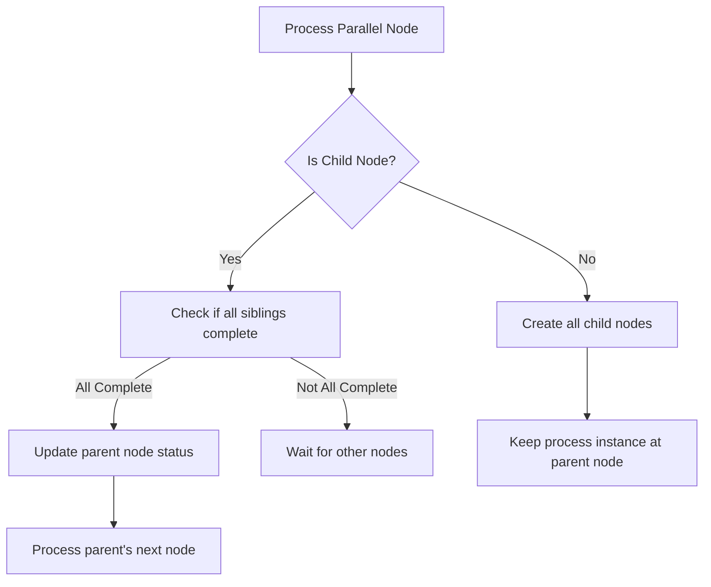
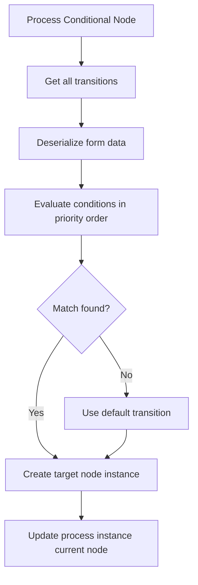
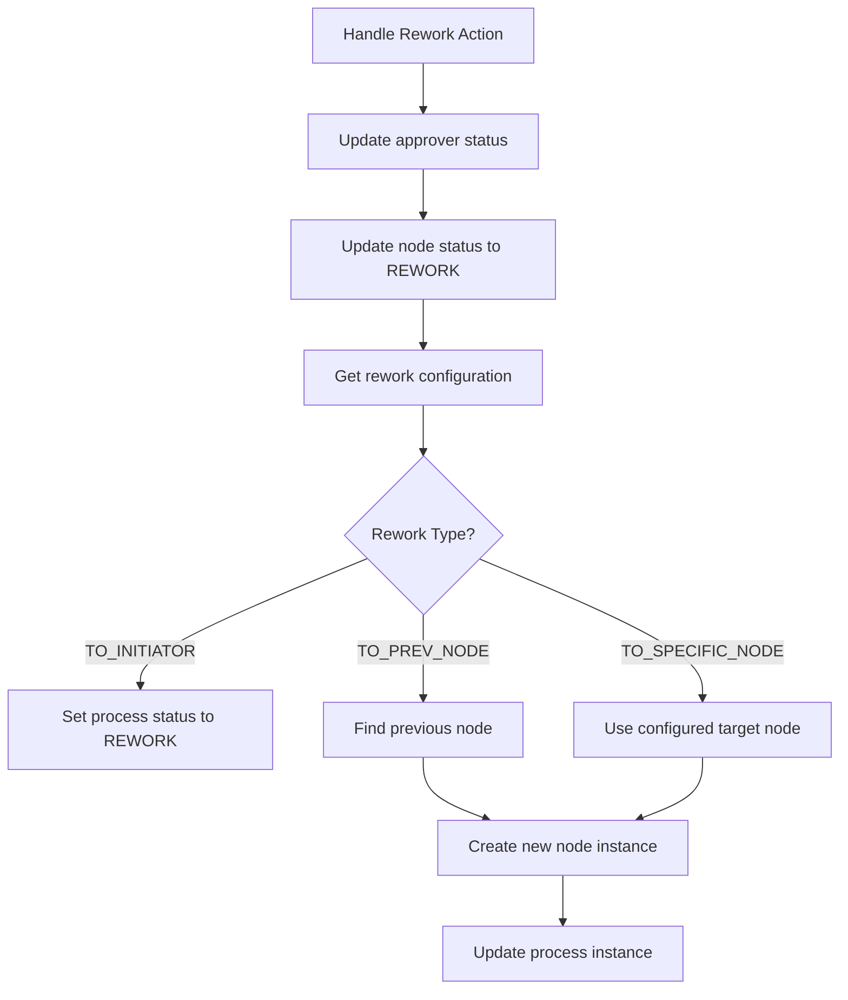
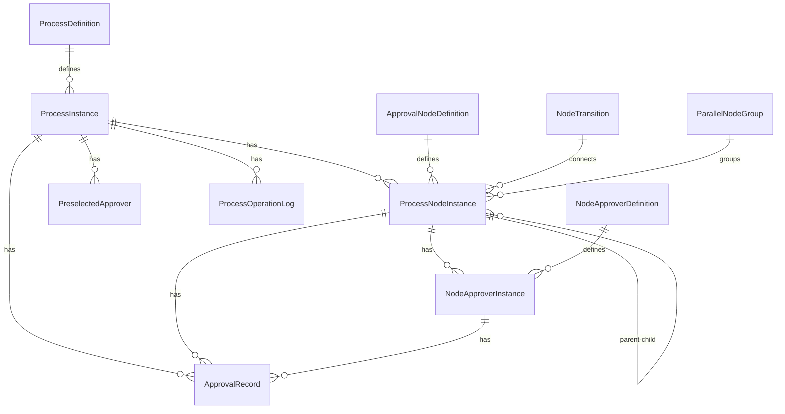

# Workflow Process Diagram Analysis
After scanning the ProcessInstanceServiceImpl class, I'll create Mermaid diagrams to explain how process instances, node instances, approver instances, and other entities are managed throughout the workflow lifecycle.

## 1. Process Instance Lifecycle

## 2. Node Instance Lifecycle

## 3. Approver Instance Lifecycle

## 4. Process Flow Sequence

## 5. Parallel Node Processing

## 6. Conditional Node Processing

##7. Rework Processing

## 8. Entity Relationship

These diagrams capture the key workflows and state transitions in the process management system, showing how entities are created, updated, and related throughout the process lifecycle.